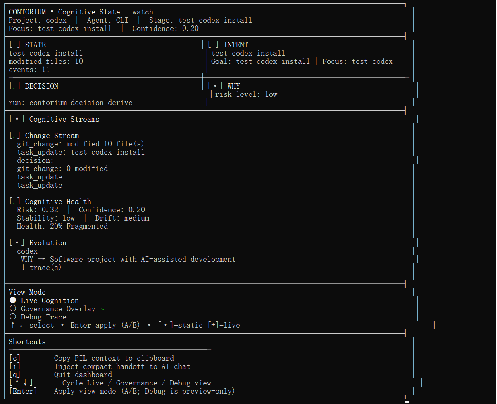
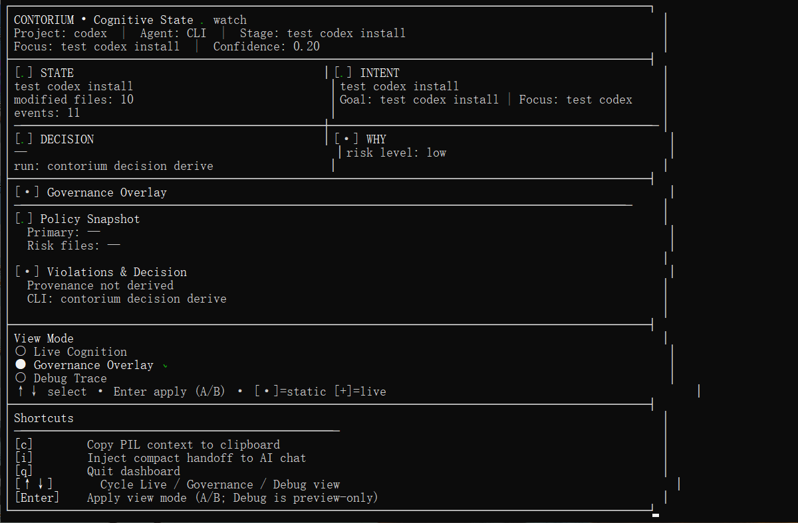
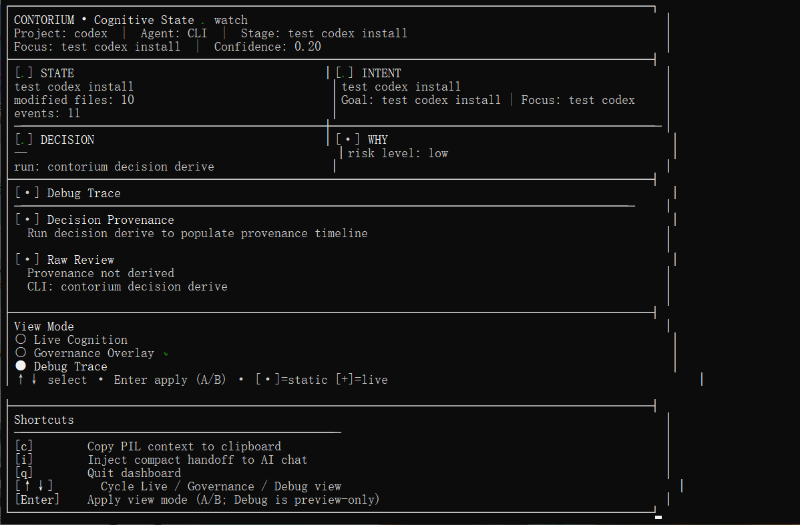

# Contorium

## Shared Project Intelligence for AI Coding Tools

Contorium preserves project understanding across Cursor, Claude Code, Codex, Gemini CLI, VS Code, and other MCP-compatible tools.

Instead of re-explaining architecture, intent, decisions, and project state in every new AI session, Contorium stores them in a shared local intelligence layer that any supported runtime can retrieve.

```text
Capture → Structure → Preserve → Retrieve → Transfer
```

> Like Git for project intelligence.

Contorium is not an autonomous coding agent.

It records, structures, preserves, and transfers project intelligence so developers and AI tools can maintain continuity across sessions.

---

## Why Contorium

AI coding tools are powerful, but stateless.

Every new session starts with:

* Lost project context
* Lost architectural reasoning
* Lost implementation decisions
* Lost project intent
* Repeated explanations

Switching between:

* Cursor
* Claude Code
* Codex
* Gemini CLI
* VS Code

often means rebuilding understanding from scratch.

Contorium preserves project intelligence in a shared local repository so any runtime can continue from where the previous one stopped.

---

## What Contorium Stores

Contorium does **not** store chat history.

It stores project intelligence:

* Current project state
* Project goals and intent
* Architectural decisions
* Decision rationale
* Timeline and evolution history
* Impact relationships
* Provenance records
* Confidence metadata

All intelligence is stored locally inside:

```text
.contora/
```

and can be retrieved by any supported runtime.

---

## AI Project Intelligence Layer (PIL)

Contorium is built around a shared intelligence model.

### Core Objects

| Object   | Question                    |
| -------- | --------------------------- |
| STATE    | What exists now?            |
| INTENT   | What is the goal?           |
| DECISION | What decision was made?     |
| WHY      | What reasoning supports it? |

### Intelligence Dimensions

| Dimension  | Question                |
| ---------- | ----------------------- |
| TIMELINE   | When did it change?     |
| IMPACT     | What does it affect?    |
| CONFIDENCE | How reliable is it?     |
| EVOLUTION  | How has it evolved?     |
| PROVENANCE | Where did it come from? |

---

## Architecture

```text
                    PIL Core

        Capture · Structure · Preserve
              Retrieve · Transfer

                         │

                 @contora/state-core

                         │

        ┌────────┬────────┬────────┐
        │        │        │
       IDE      MCP      CLI
        │        │        │
        └────────┴────────┘

                  .contora/
```

All runtimes operate on the same intelligence repository.

---

## Three Peer Runtimes

| Runtime     | Purpose                     | Loop                         |
| ----------- | --------------------------- | ---------------------------- |
| IDE Runtime | Workspace intelligence      | Capture → Inspect → Transfer |
| MCP Runtime | AI intelligence interface   | Capture → Inspect → Transfer |
| CLI Runtime | Terminal intelligence tools | Capture → Inspect → Transfer |

All three runtimes share:

```text
@contora/state-core
```

and one local intelligence repository:

```text
.contora/
```

---

## Runtime Contract (v3.0)

Every runtime implements the same capability groups.

### Capture

Record project intelligence.

Examples:

```text
capture_focus
capture_note
capture_decision
```

Examples:

```bash
contorium capture focus
contorium capture note
contorium capture decision
```

---

### Inspect

Read project intelligence.

Examples:

```text
inspect_state
inspect_intent
inspect_decision
inspect_why

inspect_timeline
inspect_impact
inspect_confidence

inspect_evolution
inspect_provenance
inspect_health
inspect_graph
```

Examples:

```bash
contorium inspect state
contorium inspect evolution
contorium inspect graph
```

---

### Transfer

Export intelligence for AI continuity.

Examples:

```text
transfer_context
transfer_intelligence
transfer_handoff
```

Examples:

```bash
contorium transfer context
contorium transfer intelligence
contorium transfer handoff
```

---

## Transfer Modes

### Transfer Context

Default AI continuity export.

Purpose:

```text
Resume work in a new AI chat
```

Size:

```text
~300–800 tokens
```

---

### Transfer Intelligence

Complete project intelligence export.

Purpose:

```text
Audit
Research
Deep analysis
Long-term archival
```

Size:

```text
~8000 tokens
```

---

### Transfer Handoff

Compact runtime handoff.

Purpose:

```text
Resume active development sessions
```

Size:

```text
~100–300 tokens
```

---

## Quick Start

### MCP

Install:

```bash
npm install -g @contorium/mcp
```

Claude Code:

```bash
claude mcp add --scope project contorium -- npx @contorium/mcp
```

Codex:

```bash
codex mcp add contorium -- npx @contorium/mcp
```

Once connected:

```text
inspect_state
transfer_context
transfer_intelligence
```

are immediately available.

---

### CLI

```bash
git clone https://github.com/ContoriumLabs/contorium.git

cd contorium

npm install

npm run compile

npx contorium init .

npx contorium inspect health .

npx contorium transfer context --copy
```

---

### IDE

Supported:

* VS Code
* Cursor

Steps:

1. Install Contorium
2. Open a folder workspace
3. Open the Contorium sidebar
4. Set Current Focus
5. Click Transfer Context

<p align="center">
  
</p>

---

## Cognitive State Dashboard

Contorium includes a terminal intelligence dashboard.

Displays:

### Cognitive Core

```text
Project
Focus
Stage
Confidence
```

### Intelligence Grid

```text
STATE
INTENT
DECISION
WHY
```

### Intelligence Streams

```text
Change Stream
Health Stream
Evolution Stream
```

### Views

```text
Live Cognition
Governance Overlay
Debug Trace
```

<table align="center">
  <tr>
    <td align="center"></td>
    <td align="center"></td>
    <td align="center"></td>
  </tr>
</table>

---

## AI Handoff

When a runtime detects active project intelligence:

```text
Runtime active. Inject current project state? (Y/n)
```

Injection is always user-controlled.

No hidden automatic prompts.

---

## Local-First Design

```text
.contora/

├── state.json
├── handoff.json
├── intent/
├── timeline/
├── graph/
├── intelligence/
├── governance/
└── events/
```

No cloud dependency.

No vendor lock-in.

All project intelligence remains local.

---

## Supported Hosts

| Host                 | Support |
| -------------------- | ------- |
| Claude Code          | Yes     |
| OpenAI Codex         | Yes     |
| Cursor               | Yes     |
| Gemini CLI           | Yes     |
| VS Code              | Yes     |
| MCP-compatible tools | Yes     |

---

## Repository Layout

```text
contorium/

├── src/
│   └── IDE Extension

├── packages/

│   ├── state-core/
│   │   └── src/pil/
│   │       ├── capture/
│   │       ├── structure/
│   │       ├── preserve/
│   │       ├── retrieve/
│   │       └── transfer/

│   ├── cli/
│   ├── mcp/
│   └── runtime/

└── docs/
```

---

## What Contorium Is Not

Contorium is not:

* An autonomous coding agent
* A task execution engine
* A recommendation system
* A project manager
* A decision-making system

Contorium preserves project intelligence.

Developers and AI tools decide what to do with it.

---

## Documentation

### Start Here

* PIL Runtime Guide
* Installation Guide
* IDE Extension Guide
* MCP Reference
* CLI Reference

### Architecture

* Project Intelligence Layer
* Cognitive Dimensions
* Architecture V3
* Architecture Core

### Operations

* Dashboard Guide
* Engineering Closure Rules
* Language Specification

See:

```text
docs/README.md
```

for the full documentation index.

---

## Links

Website:

https://www.contorium.dev

GitHub:

https://github.com/ContoriumLabs/contorium

---

## License

See LICENSE.
